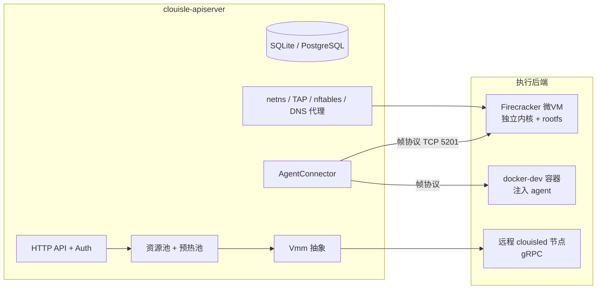
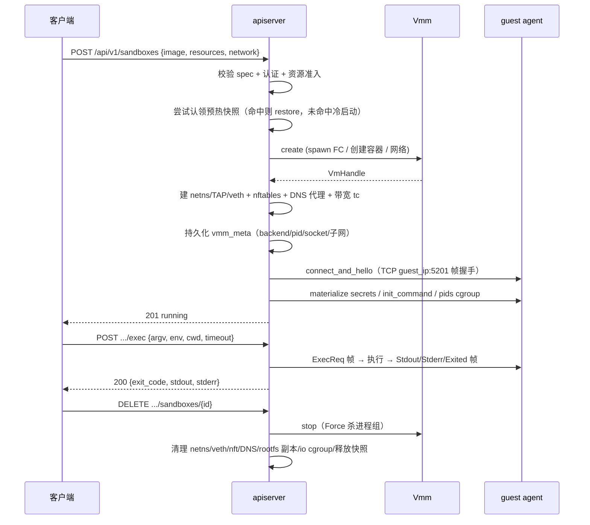

# 系统架构

## 组件总览



| 组件 | 职责 |
|---|---|
| `clouisle-apiserver` | 控制平面：REST API、认证、资源调度、状态机、预热池、清理 |
| `clouisle-agent` | guest 内静态二进制（PID 1）：帧协议服务、exec、文件、PTY、secret 注入 |
| `clouisled` | 节点守护进程：gRPC（Register/Heartbeat/CreateSandbox/DeleteSandbox/Exec/FileOp） |
| `clouisle-net` | 网络：netns 拓扑、nftables 策略、DNS 代理、子网分配 |
| `clouisle-images` | OCI 镜像拉取、rootfs 构建、agent 注入 |
| `clouisle-store` | 存储抽象：SQLite / PostgreSQL（自动选择） |
| `clouisle-vmm` | Vmm 抽象 + FirecrackerVmm + DockerDevVmm |

## 执行后端矩阵

| 后端 | 选择方式 | 隔离 | 快照 | 适用 |
|---|---|---|---|---|
| `firecracker`（默认） | `--backend firecracker` | 独立微VM（自有内核） | ✅ | 生产，需 Linux + /dev/kvm |
| `docker-dev` | `--backend docker-dev` | Docker 容器（弱） | ❌ | macOS/Windows 本地开发，需 Docker socket |
| 远程节点 | `--node-endpoint` / `--cluster-scheduling` | 远端 KVM 微VM | ✅ | 多节点集群 |

`docker-dev` 显式声明能力边界：无快照/iops/带宽/allowlist，Docker socket 等价宿主权限，仅限本地开发（`docker-compose.dev.yml` 专属，生产 manifest 绝不挂载 socket）。

## 沙盒数据流（创建 → 执行 → 删除）



## 沙盒状态机

```
Pending ──> Starting ──> Running ──> Paused ──> Stopped
                │            │
                ▼            ▼
              Error        Error（probe 失败）
                │
                ▼（restart_policy ≠ never 且 < 3 次）
             Starting（重试）
```

- `Running` 的唯一判定：guest agent 完成 Hello 握手。
- reconcile 每周期扫描：死 runtime 标 Error；存活 Starting 修正 Running；孤儿清理。
- 重启恢复：API 重启后按 vmm_meta 恢复运行时句柄，probe 验证。

## 控制面组件

- **认证**：`CLOUISLE_API_KEYS`（`key:tenant:scope`，scope=full/read）；Bearer 认证；health/metrics 免认证。
- **资源池**：`ResourcePool` 按 vCPU/内存准入（`manage_resources`）；warm pool 预热快照。
- **预热池**：`warm_snapshot` 后台为持久化模板预建 FC 快照；create 命中时 0.2s 返回（冷创建 ~6s）。
- **存储**：`postgres://` / `postgresql://` → PostgresStore（自动重连）；其余 SQLite（WAL）。
- **可观测性**：`/health`、`/health/live`、`/health/ready`、`/metrics`（Prometheus）、`X-Request-Id`。

## 数据面隔离（生产 FC 路径）

| 维度 | 机制 |
|---|---|
| CPU/内存/磁盘 | FC machine-config + 资源准入 |
| 进程数（pids_max） | guest 内 cgroup v2 pids.max |
| 带宽（bandwidth_mbps） | host netns `tc tbf` |
| IOPS（iops） | host cgroup v2 io.max（需 io 控制器暴露设备） |
| rootfs | 每沙盒独立 ext4 副本（冷创建复制 + stop 清理） |
| 网络出站 | 宿主 nftables（allowlist 白名单 + drop 兜底） |
| 密钥 | agent Hello 后写 `/run/secrets`（0600），响应 REDACTED |
| 挂载 | 仅受控来源 + 只读（FC 路径 + docker-dev mount_root 校验） |

详见 [features.md](features.md)。
